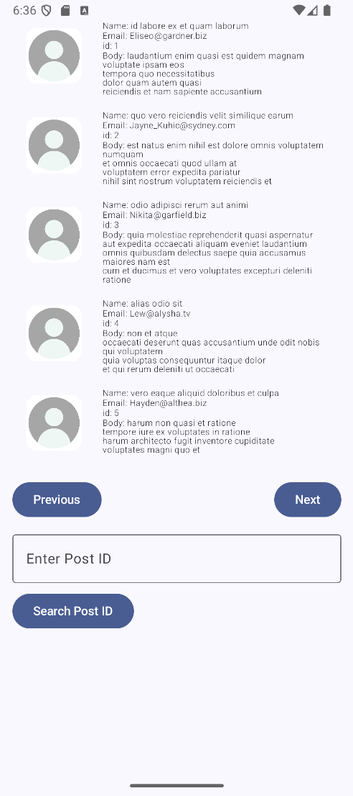
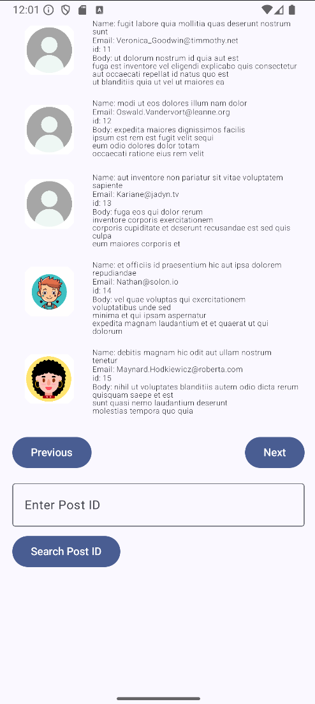

# Comment App

## Overview
The Comment App is an Android application built using modern development practices, including Jetpack Compose and MVVM architecture. This app fetches comments from an external API and displays them in a user-friendly interface, featuring profile photos, detailed comment information, and clipboard interaction.

## Features
- **Fetch and Display Comments**: Retrieves comments from a remote JSON API using Retrofit.
- **Profile Photos**: Allows users to upload a profile photo for each comment by selecting images from the device gallery.
- **Clipboard Interaction**: Users can copy the email of a comment to the clipboard by tapping the email text.
- **Responsive UI**: Designed using Jetpack Compose for modern and smooth UI interactions.

## Technologies Used
- **Programming Language**: Kotlin
- **Architecture**: MVVM (Model-View-ViewModel)
- **UI Toolkit**: Jetpack Compose
- **Networking**: Retrofit
- **Coroutines**: For asynchronous operations
- **State Management**: LiveData/StateFlow

## Installation
1. **Clone the Repository**:
   ```bash
   git clone https://github.com/rhong0330/takehome.git
   cd takehome
   ```
2. **Open in Android Studio**:
    - Open Android Studio and select "Open an existing project."
    - Navigate to the cloned repository and open it.

3. **Sync Gradle**:
    - Ensure that your Gradle dependencies are synced by clicking "Sync Now" when prompted.

## Usage
- **Fetching Comments**: The app automatically fetches comments on launch.
- **Viewing Details**: Each comment displays a profile photo, name, ID, body, and an email button.
- **Upload Profile Photo**: Tap the profile photo area to select and upload an image from the device.
- **Copy Email**: Tap the email to copy it to the clipboard.
- **Navigate Through Posts**: Use buttons to view the next or previous comments by post ID.

## API Reference
- The app uses the [JSONPlaceholder API](https://jsonplaceholder.typicode.com/) for fetching comment data:
  ```
  https://jsonplaceholder.typicode.com/posts/{postId}/comments
  ```

## Screenshots



## Future Enhancements
- **Pagination**: Adding pagination for better handling of large data sets.

## License
This project is licensed under the MIT License. See the [LICENSE](LICENSE) file for more details.

## Contact
For any questions or feedback, please contact [rhong0330@gmail.com](mailto:rhong0330@gmail.com).


